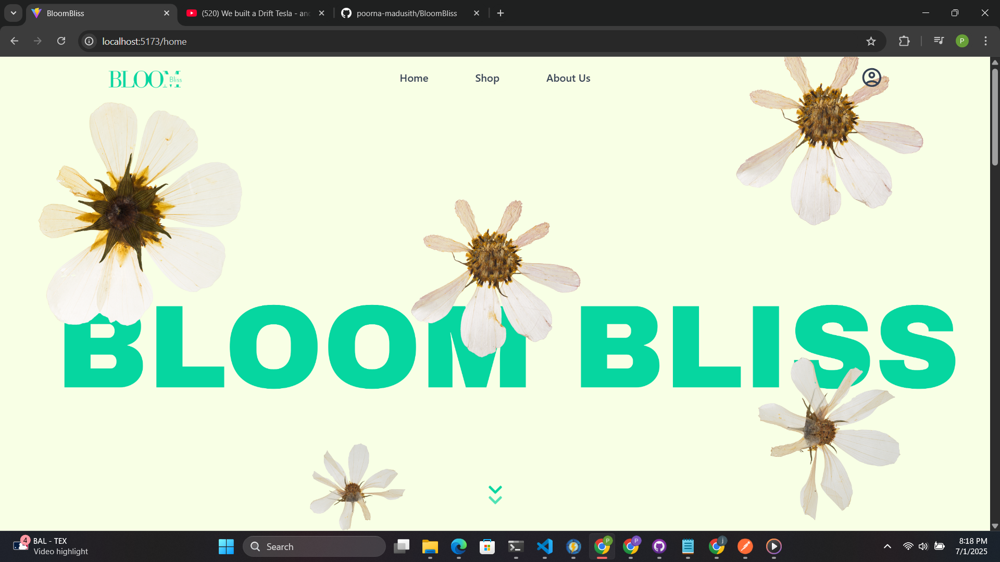

# BloomBliss - Online Flower Shop 🌸



BloomBliss is a full-stack e-commerce web application for a flower shop, offering a wide variety of flowers, bouquets, plants, and gift hampers. Built with modern web technologies, it provides a seamless shopping experience for customers looking for beautiful floral arrangements.

## Features ✨

- **User Authentication** 
  - Secure signup and login system
  - User profile management
  - JWT-based authentication

- **Product Management**
  - Browse flowers by categories
  - Detailed product views with images and descriptions
  - Advanced filtering and search capabilities

- **Shopping Experience**
  - Interactive shopping cart
  - Secure checkout process
  - Order tracking
  - Real-time stock updates


## Tech Stack 🛠️

### Frontend
- React.js
- Vite
- Tailwind CSS
- Context API for state management
- Axios for API communication

### Backend
- Node.js
- Express.js
- MongoDB
- JWT Authentication
- Middleware for authorization

## Getting Started 🚀

### Prerequisites
- Node.js (v14 or higher)
- MongoDB
- npm or yarn

### Installation

1. Clone the repository
```bash
git clone https://github.com/yourusername/BloomBliss.git
cd BloomBliss
```

2. Install Backend Dependencies
```bash
cd backend
npm install
```

3. Install Frontend Dependencies
```bash
cd frontend
npm install
```

4. Set up environment variables
Create `.env` files in both frontend and backend directories with necessary configurations.

5. Start the Development Servers

Backend:
```bash
cd backend
npm run dev
```

Frontend:
```bash
cd frontend
npm run dev
```

## Project Structure 📁

```
backend/
    ├── config/         # Database and other configurations
    ├── controllers/    # Request handlers
    ├── middleware/     # Custom middleware
    ├── models/         # Database models
    ├── routes/         # API routes
    └── uploads/        # File uploads storage

frontend/
    ├── public/         # Static files
    ├── src/
    │   ├── assets/     # Images and other assets
    │   ├── components/ # React components
    │   ├── context/    # Context providers
    │   ├── css/        # Stylesheets
    │   └── services/   # API services
```

## API Endpoints 🔌

### Auth Routes
- `POST /api/auth/signup` - Register new user
- `POST /api/auth/login` - User login
- `GET /api/auth/profile` - Get user profile

### Product Routes
- `GET /api/flowers` - Get all flowers
- `GET /api/flowers/:id` - Get flower by ID
- `POST /api/flowers` - Add new flower (Admin)
- `PUT /api/flowers/:id` - Update flower (Admin)
- `DELETE /api/flowers/:id` - Delete flower (Admin)

### Order Routes
- `POST /api/orders` - Create new order
- `GET /api/orders` - Get user orders
- `GET /api/orders/:id` - Get order by ID

## Contributing 🤝

Contributions are welcome! Please feel free to submit a Pull Request.

1. Fork the project
2. Create your feature branch (`git checkout -b feature/AmazingFeature`)
3. Commit your changes (`git commit -m 'Add some AmazingFeature'`)
4. Push to the branch (`git push origin feature/AmazingFeature`)
5. Open a Pull Request

## License 📝

This project is licensed under the MIT License - see the [LICENSE](LICENSE) file for details.

## Acknowledgments 🙏

- Thanks to all contributors who have helped shape BloomBliss
- Special thanks to the open source community for the amazing tools and libraries

## Contact 📧


